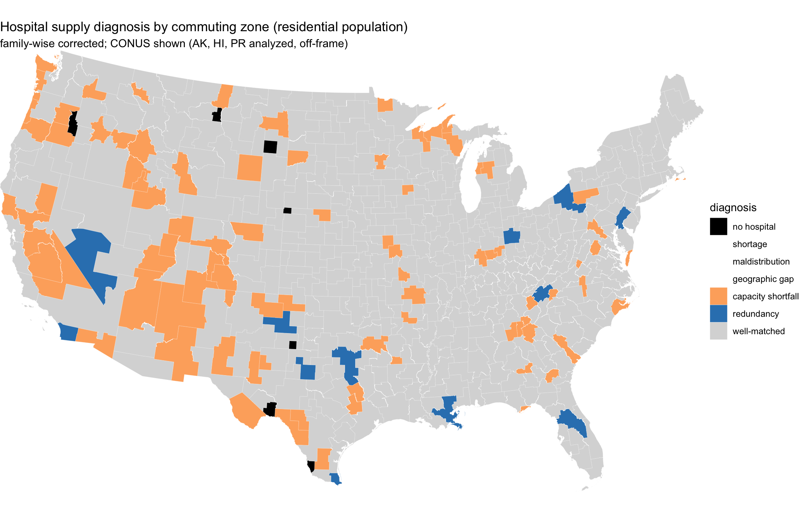
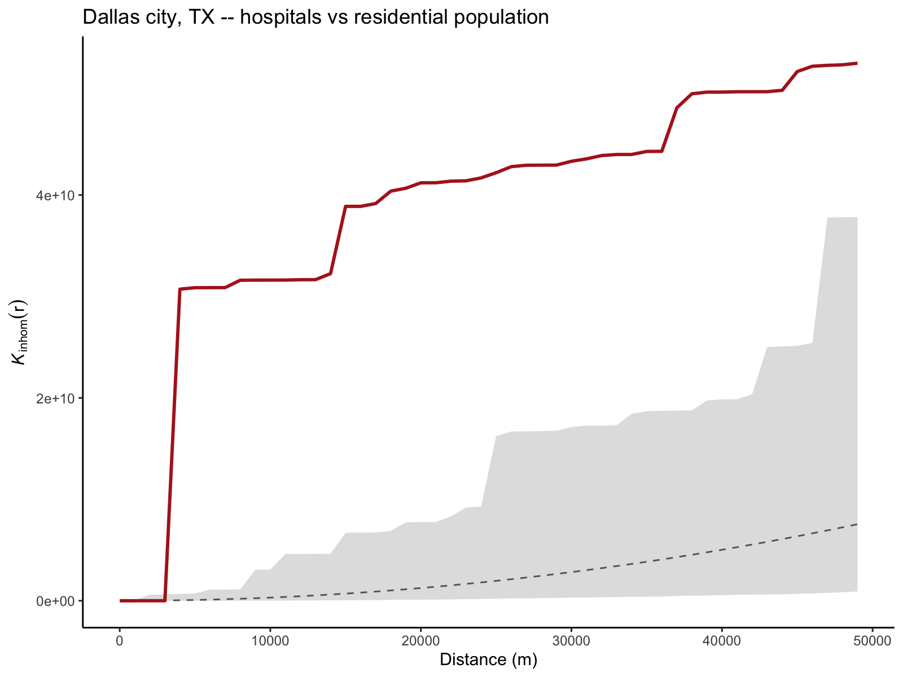

# Results

All results use the 2020 vintage (LandScan ambient and GPWv4.11 residential
population, USDA 2020 commuting zones, HIFLD hospitals). Point-process tests use
999 simulations and the global extreme-rank-length (ERL) envelope, corrected for
family-wise error across zones. Numbers are generated from `output/summary.csv`
and the across-zone tests; per-zone diagnoses are in `output/typology_*.csv`.

## Sample

The 598 US commuting zones contain 7,966 open hospitals (1,087,608 known staffed
beds). Every zone receives a **sufficiency** value and, where it has at least one
hospital, a **coverage** test (586 zones); the 12 zones with no hospital are
reported separately. The second-order **concentration** test is computed for the
262 zones with at least 8 hospitals, which together hold about 91% of the
population. Each analysis is run twice, under ambient and residential population.

## Concentration

Whether hospital locations are more clustered than population depends entirely on
the population surface. Under **residential** population, **15 of 262** zones are
significantly over-concentrated on facilities (combined family-wise
$p = 0.002$) and **13 of 262** on beds ($p = 0.001$). Under **ambient**
population, the signal vanishes: **0 of 262** zones on either facilities
($p = 0.475$) or beds. In other words, hospital clustering that looks excessive
against where people sleep is fully consistent with where people are during the
day. The over-concentrated (residential) set is led by large and mid-size metros
(for example Dallas, San Diego, Philadelphia, Orlando, Las Vegas, New Orleans).
The effect is substantial where present: expressed through the variance-
stabilized $L$-function ($L = \sqrt{K/\pi}$), the flagged zones cluster at a
10 km scale a median of 2.9 times more tightly than a population-proportional
placement (interquartile range roughly 1.5 to 11 times, and higher in a few
sparse zones such as Anchorage), so these are large departures, not marginal
ones.

The bed-weighted test is not redundant with the facility test: capacity and
building count diverge. Of the residential-population zones flagged, 9 are
over-concentrated on both facilities and beds, 6 on facilities only (Brownsville,
Dallas, Dayton, Erie, Johnson City, San Diego, where many similarly sized
hospitals cluster without concentrating capacity), and 4 on beds only (Allentown,
Augusta, Jacksonville, Saginaw, where a few large hospitals concentrate capacity
even where building locations are not over-clustered). Measuring capacity
therefore flags zones a facility-count analysis would miss. The bed weighting
imputes the 5.2% of hospitals with an unknown bed count; the 9 zones where more
than half of beds are unknown are flagged and excluded from bed claims.

## Coverage

The pattern reverses on coverage. Under **ambient** population, **6 of 586**
zones have populations significantly farther from care than a population-
proportional placement would leave them (combined $p = 0.001$): Amarillo,
Dallas, Detroit, Houston, San Diego, and San Juan (PR). Under **residential**
population, **0 of 586** survive family-wise correction ($p = 0.126$). The
ambient lens reveals access gaps that the residential surface hides. Because
coverage credits hospitals within 50 km across zone boundaries, these are not
edge artifacts. The magnitudes are meaningful: at the distance of peak deviation,
each desert leaves an extra 9 to 37 percentage points of its population beyond
reach relative to the null (largest in Amarillo), and Amarillo's
population-weighted mean distance to care runs about 3 km above what a
population-proportional placement would give.

{width=78%}

## Sufficiency

Zone-level capacity is right-skewed: the median zone has 4.6 (ambient) / 4.4
(residential) staffed beds per 1,000, well above the US population-weighted
average of ~2.8 [@kff_beds_2020], because many low-population rural zones carry
high per-capita capacity while dense metros sit low, the documented rural-urban
capacity gradient [@hegland_owens_selden_2022]. Below the US reference fall **88** zones
under ambient and **114** under residential population; below the OECD reference
(~4.3), 251 and 289 respectively. The denominator matters: commuter-destination
zones look better supplied on residential population and worse on ambient, and
the reverse for bedroom communities.

## The diagnostic typology

Combining the three corrected axes classifies each zone (Table 1; national maps
below).

| Diagnosis | Ambient | Residential |
|-----------|--------:|------------:|
| no hospital | 12 | 12 |
| shortage | 0 | 0 |
| maldistribution | 0 | 0 |
| geographic gap | 6 | 0 |
| capacity shortfall | 76 | 102 |
| redundancy | 0 | 13 |
| well-matched | 504 | 471 |

Two results stand out. First, **over-concentration and under-service do not
co-occur** in the same zone (maldistribution = 0 under either surface). This is
partly structural and should be read as such: concentration is tested only in the
262 hospital-dense zones, whereas the deserts are rural zones that mostly fall
below the 8-hospital floor, so the two diagnoses are drawn from largely disjoint
sets of zones and their non-overlap is closer to expected than surprising. It is
still informative that no dense zone is simultaneously clustered and stranded,
but we do not read it as a strong empirical discovery. Second, the dominant
flagged category flips with the demand surface: residential population yields a
**redundancy** story (13 zones, clustering beyond population) and no coverage
gaps, whereas ambient population yields a **geographic-gap** story (6 zones) and
no redundancy. Two points on how these counts are formed. The 13 redundancy
zones are fewer than the 15 flagged over-concentrated on facilities because the
diagnostic rule is a priority cascade (see Methods): two of the fifteen (Fort
Collins and Fresno) also fall below the US bed average and are therefore
reported under *capacity shortfall*, so the redundancy count is a lower bound on
residential over-concentration. And all six ambient geographic-gap zones were
hospital-dense enough to be tested on concentration and returned proportional
(they are not merely untested), so the label reflects a measured, not assumed,
proportional arrangement.

{width=98%}

{width=98%}

## Ambient versus residential

**44 of 598 zones change diagnosis** between the two surfaces. The clearest
cases are metros that are simultaneously over-concentrated against residential
population and under-served against ambient population, so their diagnosis moves
from *redundancy* (residential) to *geographic gap* (ambient): Dallas, San
Diego, and Amarillo are in both flagged sets. Dallas is illustrative (panels
below): its hospitals cluster beyond nighttime population yet leave daytime
population comparatively far from care. The demand surface does not refine the
conclusion; it reverses it.

{width=68%}

{width=68%}

This reversal is driven by the day-versus-night timing of the demand surface,
not by how the surface is built. LandScan (ambient) is a dasymetric, modeled
product while GPW (residential) is areal, so a modeled-versus-areal difference
could in principle confound the ambient-versus-residential contrast. We rule
that out with a third surface, WorldPop, which is modeled like LandScan but
residential like GPW. Under WorldPop, hospital concentration behaves like the
residential (GPW) surface, not the ambient one: 18 of 258 zones are
significantly over-concentrated on facilities (combined $p = 0.001$) and 17 on
beds, with 0 of 576 zones under-served on coverage ($p = 0.477$). Both
residential surfaces, whether areal (GPW) or modeled (WorldPop), yield
over-concentration and no coverage gaps, while the ambient surface yields the
reverse. The effect therefore tracks whether population is counted by day or by
night, not the construction of the raster. (WorldPop is US-only, so Puerto Rico
and a small number of coverage-gap zones are absent, leaving 258 rather than 262
concentration zones; this does not affect the comparison.)

## Validation and robustness

Type-I calibration by simulation (target 0.05) gives facilities 0.040, beds
0.043, and coverage 0.040, confirming the estimators, including the newer bed
and coverage constructions, are well behaved. A power analysis against an
inhomogeneous Thomas over-concentration alternative (cluster scale 2.5 km) shows
power rising from 0.67 at 8 hospitals to 0.80 at 10 and 0.99 at 30, with Type-I
near nominal throughout, so the 8-hospital floor is permissive rather than
lax. The concentration result is stable to that floor: re-running the residential
facility test at minimum 8, 10, and 15 hospitals flags 15, 14, and 9 zones
(combined $p = 0.002, 0.002, 0.030$) and the bed test 13, 12, and 9, so raising
the threshold only shrinks the eligible pool without overturning the finding.

The coverage axis has its own power analysis. Against a manufactured desert (a
zone whose hospitals are drawn proportional to population but only within a
central core, stranding a set fraction of the population in the periphery),
Type-I is near nominal (about 0.05) throughout, and power depends on the desert's
geometry: in a geographically distinct desert such as San Diego's backcountry the
test reaches power 0.99 once 20% of the population is stranded, whereas in a
monocentric zone such as Amarillo, where a population-proportional placement
already leaves the sparse periphery far from care, power is lower (about 0.37 at
40% stranded). The coverage test is therefore conservative, and the six zones it
flags family-wise are strong rather than marginal detections. Finally, the
concentration verdicts do not depend on using a Poisson (random-count) null: re-
running eight representative zones with a fixed-count binomial null (exactly $n$
hospitals placed proportional to population) reproduces every verdict (8 of 8
agree), with $p$-values differing by at most 0.16 and only in zones far from the
0.05 boundary.

The coverage (desert) results are invariant to the cross-border buffer distance.
Recomputing the coverage test for the ambient under-served zones at 25, 50, and
100 km buffers leaves every zone's verdict unchanged: Amarillo, Dallas, Detroit,
Houston, and San Juan remain significantly under-served at all three distances,
and San Diego remains borderline throughout. Crediting hospitals as far as 100 km
across zone boundaries therefore does not dissolve the deserts, so they are not
an artifact of the 50 km default.

Nor are the deserts an artifact of straight-line distance. For all six under-
served zones we routed a population-weighted sample of each zone's most distant
populated cells to the nearest hospital on the OpenStreetMap driving network
(OSRM) and compared the road distance to the Euclidean distance. Road distance
exceeds Euclidean distance in every zone, by a median factor of 1.13 (Amarillo)
to 2.62 (Houston), so travel distance makes the deserts worse, not better: the
stranded populations remain at least 10 km from care by road, and in the two
genuinely rural deserts (Amarillo and San Diego's backcountry) the most distant
decile sits 30 to 70 km away by road. Because road detours only lengthen these
distances, Euclidean distance is a conservative proxy here and the deserts are
not a straight-line artifact.

Re-running the entire analysis on 939 CBSA windows shows the concentration
result is robust to the partition while clarifying the coverage result. Under
CBSAs, concentration behaves exactly as under commuting zones: 0 of 185
hospital-dense CBSAs are over-concentrated against ambient population and 15 of
185 against residential (combined $p = 0.001$). Coverage, by contrast, flags no
zones under either surface on CBSAs (0 of 927). This is expected and supportive
rather than contradictory: CBSAs cover only urbanized cores and their immediate
commuting fringe, so the under-served populations, which sit in the rural areas
that commuting zones include but CBSAs omit, lie outside the CBSA windows
altogether. The coverage deserts are therefore a genuine property of rural
populations that only the whole-country commuting-zone partition captures, not
an artifact of the commuting-zone boundaries; and the concentration finding does
not depend on the windowing choice at all.

A final check addresses whether the ambient result is mechanically induced by
the hospitals themselves. LandScan assigns daytime population to workplaces,
including hospitals (staff, outpatients, and visitors), so an ambient cell that
contains a hospital is inflated partly because the hospital is there. If that
self-induced population were large it could artificially satisfy the
population-proportional null and explain why over-concentration disappears under
ambient population. It does not. The share of each concentration zone's ambient
population falling in the roughly 1 km cells that contain a hospital is small
(median 2.7%, at most 8.8%, and 3.2% pooled across zones), and this is an upper
bound because those cells also hold ordinary residents and workers unrelated to
the hospital. To test the concern directly, we re-ran the concentration axis on a
modified ambient surface in which every hospital-containing cell is replaced by
its local neighborhood background (the mean of the surrounding cells), stripping
the hospital's self-induced population while leaving the surrounding demand field
intact. We replace rather than delete the cell because the inhomogeneous
$K$-function weights each hospital by the inverse of the null intensity at its own
location, so zeroing that cell would divide by an intensity of almost zero and
spuriously inflate clustering. Under this hospital-neutralized ambient surface the
result is unchanged: 0 of 262 zones are over-concentrated (combined $p = 0.446$),
the same verdict and essentially the same $p$-value as the unmodified ambient
surface (0 of 262, $p = 0.475$). The ambient-versus-residential reversal therefore
does not arise from population that hospitals induce at their own locations.

A related question is whether the reversal is merely a restatement of "LandScan
is uniformly more urban-core-weighted than GPW," which would make it a mechanical
consequence of raster geometry rather than an informative result. It is not. If
one surface were the other scaled by a single urban multiplier, then after
normalizing each surface to integrate to one over a zone their ratio would be
identically one everywhere, because the normalization cancels any global factor.
Instead, the normalized ambient-to-residential ratio at hospital locations has a
median of 1.73 across the 262 zones (above one in 251 of them) against a
residential-weighted baseline of exactly one, and it is higher still (1.94) in
the fifteen zones that flip. Hospitals therefore sit disproportionately in cells
that carry more of the zone's ambient (daytime) population than its residential
population, a structured coincidence between hospital sites and daytime
destinations that a uniform reweighting cannot produce. The reversal reflects
where hospitals actually are relative to where people are by day, not raster
construction.

One asymmetry in the typology deserves emphasis. Concentration and coverage are
tested against a null; sufficiency is compared to a fixed bed-per-1,000 threshold
and is therefore not a test but a threshold crossing. Its largest typology cell,
capacity shortfall, is correspondingly sensitive to that threshold: the count of
residential capacity-shortfall zones moves from 38 to 102 to 277 as the cutoff
rises from 0.7 times the US average to the US average (2.8 per 1,000) to the OECD
average (4.3 per 1,000), whereas the tested categories (redundancy, geographic
gap) are unaffected. Sufficiency conclusions should be read as descriptive
relative to an explicit, and movable, reference rather than as a statistical
verdict, and the beds-per-1,000 denominator inherits the same
commuter-destination-versus-bedroom-community ambiguity as the rest of the study.
